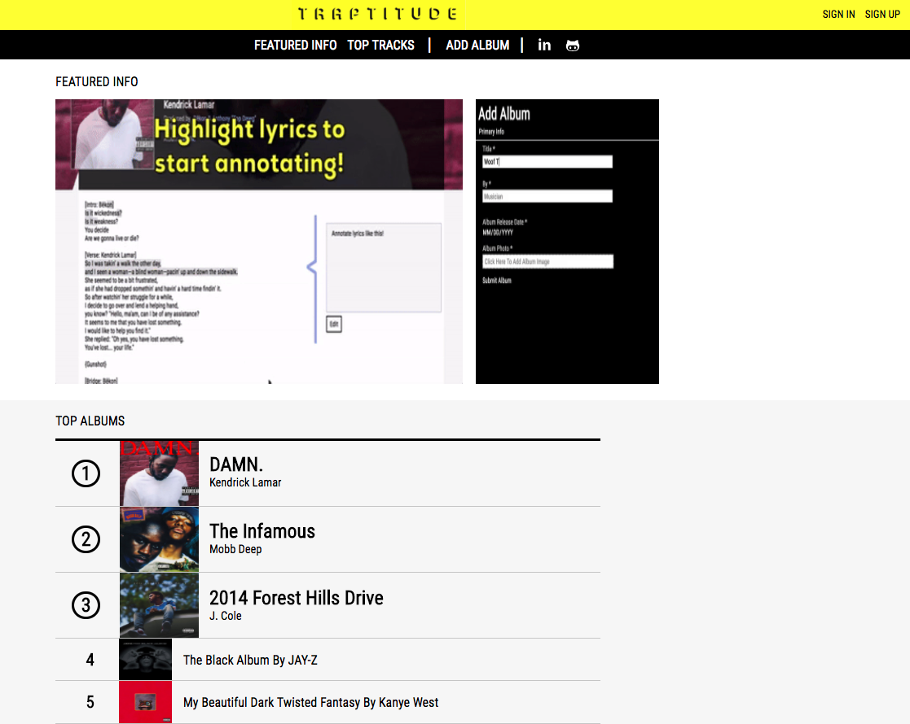

# Traptitude

[Traptitude Live][live]

[Live]: http://traptitude.com

Traptitude is a Genius.com inspired app where users can access and contribute crowd-sourced annotations.
It utilizes a Ruby on Rails backend with a PostgreSQL database and a front-end built using React.js with a Redux architectural framework.

### Annotations

Users, once logged in, can create annotations by using their mouse to highlight lyrics that they wish to contribute to. The create annotation function will only run if the selected lyrics have not been previously annotated before. Once the annotation has been created, users are then given the options to update or delete that annotation. If the user is not logged in and tries to create an annotation by selecting lyrics, the sign-in modal will appear.

### Albums

Albums can be added through the album form page which can be accessed by clicking the add album link in the header. Albums require a title, musician, release date, and an album photo in order to be created.

### Tracks

Tracks can be added to an album by going to the album's page and clicking the add track link. Tracks require only a title and lyrics to be created but also has inputs for features and producers.

### Favorites

 Users that are logged in are given the ability to add and remove tracks to their favorites. An empty heart will appear next to the track's title in the track show page once successfully logged in. Clicking on the heart will cause it to appear full, thus adding the track to the user's favorites. Removing a track from the user's favorites works in a similar fashion.
